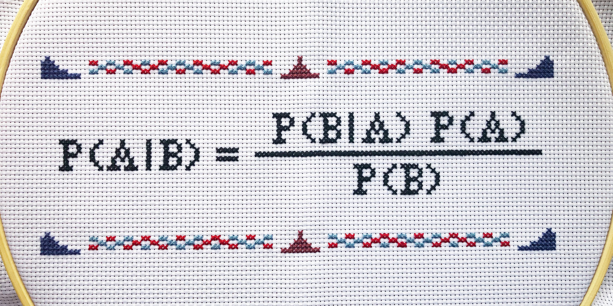
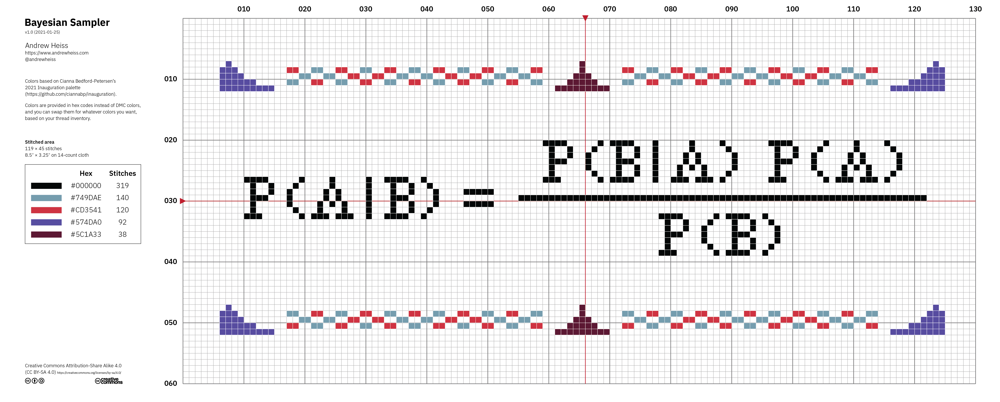

<a href="#downloads">Jump to the downloads</a> and get your own free pattern!

For my latest pandemic art medium (on this, the three hundred and nineteenth day of sheltering in place), I decided to teach myself how to cross stitch. I did a ton of needlepoint as a kid and teen, but was always afraid of cross stitch because it was so much smaller and more delicate.

I somehow stumbled across [this lesson repository](https://sgibson91.github.io/cross-stitch-carpentry/index.html) created by The Carpentries, an organization that normally teaches workshops on reproducible research and data scientific software like R and Python. This nifty [Cross Stitch Carpentry](https://sgibson91.github.io/cross-stitch-carpentry/index.html) workshop is incredibly helpful and easy to follow, and after downloading [a pattern from Etsy](https://t.co/7d0BS3A0K9), I successfully made my first cross stitched thing: [a miniature porg](https://twitter.com/andrewheiss/status/1353172960119566336?s=21).

I next wanted to make something related to my work with data and stats. In July, I made [a linocut print of the R logo](https://twitter.com/andrewheiss/status/1287200192647827459?s=21), so I considered doing that with cross stitch too, but that seemed like a lot of thread. Also, I couldn’t find a good way to make a good pattern. There’s [a neat Python program named **ih**](https://github.com/glasnt/ih) that automatically creates embroidery and cross stitch patterns from images, and there are plenty of (sketchy?) online resources for converting images to patterns (they probably rely on **ih** behind the scenes?), but I like having more control over the output.

After lots of googling, I found that [you can use Adobe Illustrator to create cross stitch patterns](https://blog.stitchpeople.com/creating-graph-templates/) (there’s an archived Facebook Live video [showing the process here](https://www.facebook.com/stitchpeople/videos/day-1-of-cross-stitch-a-portrait-with-lizzy/512456752992667/)), which is perfect, since I use Illustrator all the time.

So I drew the formula for [Bayes’ theorem](https://en.wikipedia.org/wiki/Bayes%27_theorem) with little boxes, added some flourishes and borders, and made my first cross stitch pattern, which I then made into an actual cross stitch: a Bayesian [sampler](https://mc-stan.org/docs/2_26/reference-manual/hamiltonian-monte-carlo.html)!

The color palette is inspired from the jewel colors of the 2021 inauguration (via Cianna Bedford-Petersen’s [R package](https://github.com/ciannabp/inauguration)). The density plots in the corners and center are stylized prior and posterior distributions. The borders on the top and bottom are stylized trace plots showing intertwined [MCMC chains](https://en.wikipedia.org/wiki/Markov_chain_Monte_Carlo).

I’ve polished the pattern in Illustrator and released it for free! (with a Creative Commons license). I’ve also provided the original Illustrator file so that you can make your own designs—just delete the stuff on the Text and Pattern layers and add little rectangles filled with some color + a 0.5 point white stroke.

Download everything here!

- [“Bayesian Sampler” PDF](bayesian-sampler.pdf) (v1.0, 2021-01-25)
- [“Bayesian Sampler” paginated PDF](bayesian-sampler-paginated.pdf)
- [“Bayesian Sampler” Illustrator file](bayesian-sampler.ai)

