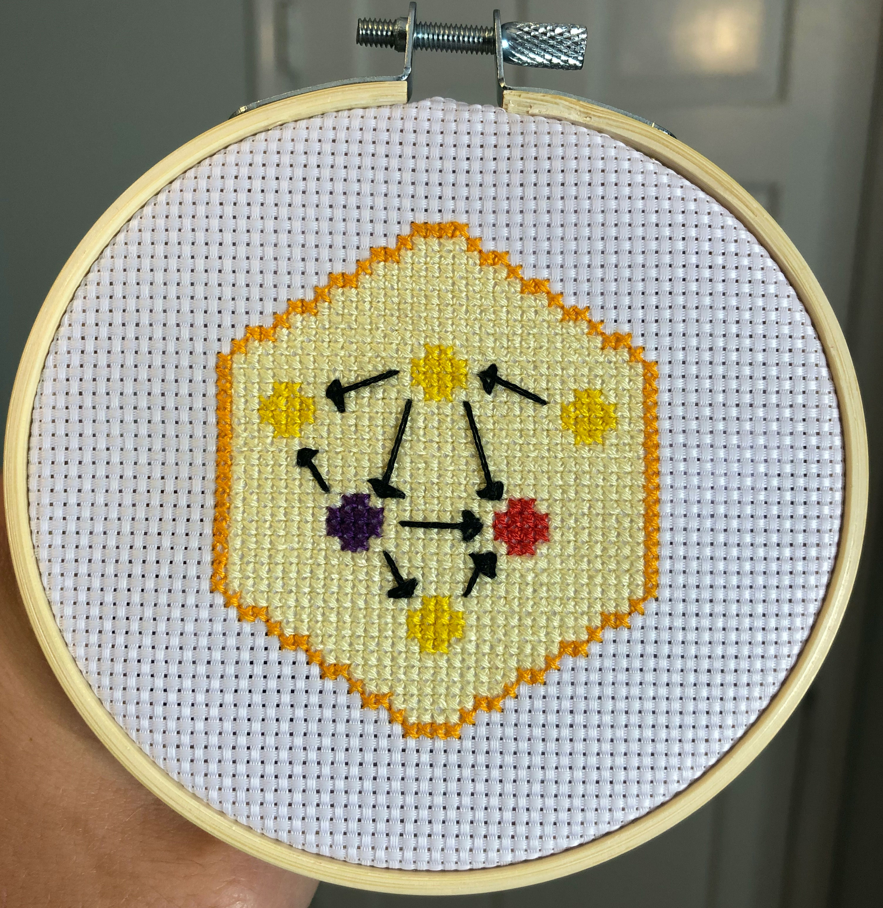
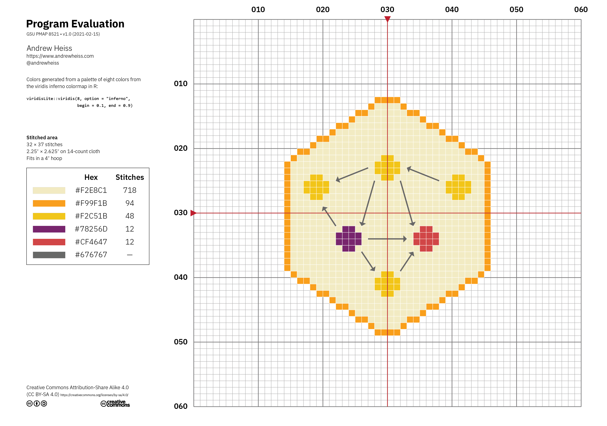

<a href="#downloads">Jump to the downloads</a> and get your own free pattern and template files!

In the data science world, hex stickers with logos of developers' favorite packages are all the rage. People collect them at conferences and events and display them on their laptops (or, like me, keep them in a pile on their desk because they're too afraid to commit to affixing them anywhere permanently). There are even [official standard dimensions](http://hexb.in/sticker.html) and [templates](https://github.com/terinjokes/StickersStandard) people can follow.

Just for fun, I make hex logos for each of my classes ([program evaluation/causal inference](https://evalsp21.classes.andrewheiss.com/), [microeconomics](https://econs21.classes.andrewheiss.com/), and [data visualization](https://datavizs21.classes.andrewheiss.com/))—see all [my class and package hex logos here](https://github.com/andrewheiss/hex-stickers)—and in non-pandemic times I print them and hand them out to students at the beginning of class. They look awesome.

Continuing my pandemic art kick (on this, the four hundred and eighty-fifth day of sheltering in place), and following my foray into cross stitch (like [this Bayesian Sampler](https://www.andrewheiss.com/blog/2021/01/26/bayesian-cross-stitch-sampler/)), I decided to make cross stitch versions of my hex logos. So I stuck my program evaluation logo into Illustrator, pixel-art-ified it by hand, and made the thing.

The design is a generic [DAG](https://en.wikipedia.org/wiki/Directed_acyclic_graph) showing an exposure, an outcome, an indirect effect, a confounder, and a collider; the color palette comes from the viridis inferno scale, generated with `viridisLite::viridis(8, option = "inferno", begin = 0.1, end = 0.9)` in R.

To help the world create hex logo cross stitch art, I've provided the Illustrator file for free! (with a Creative Commons license). Make your own designs—just delete the stuff on the Text and Pattern layers and add little rectangles filled with some color + a 0.5 point white stroke.

Download everything here!

- [Hex logo cross stitch PDF](hex-sticker-template.pdf) (v1.0, 2021-02-15)
- [Hex logo cross stitch Illustrator file](hex-sticker-template.ai)

