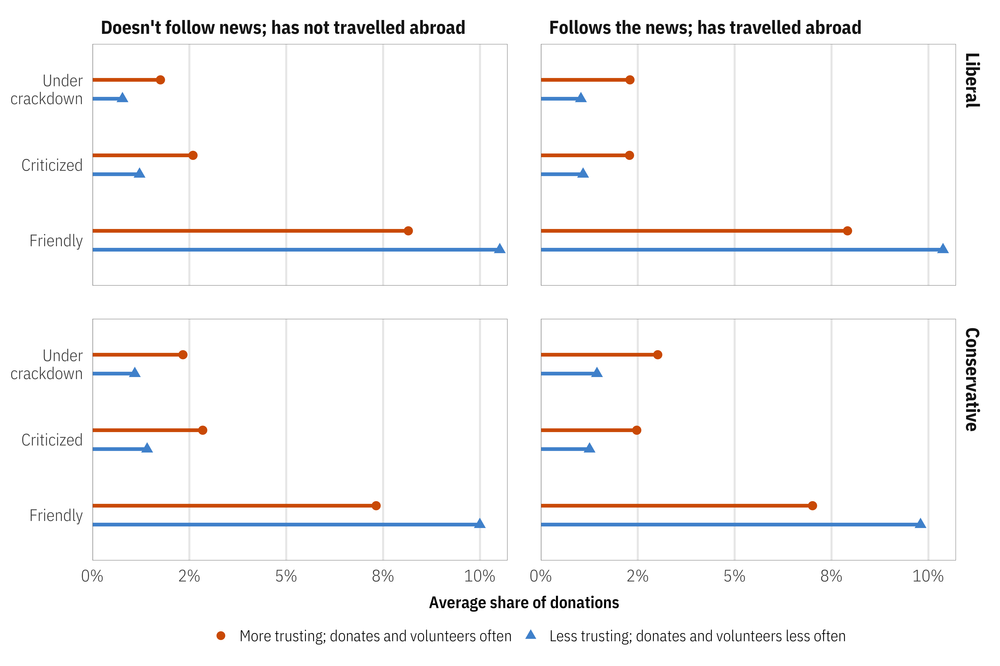

&nbsp;

 &emsp;  &emsp; 

## Important links

- [Paper (preprint)](chaudhry-dotson-heiss-who-cares-crackdowns.pdf)
- [Appendix (preprint)](chaudhry-dotson-heiss-who-cares-crackdowns-appendix.pdf)
- [Statistical analysis notebook](https://stats.andrewheiss.com/who-cares-about-crackdowns/)
- [GitHub repository](https://github.com/andrewheiss/who-cares-about-crackdown)
- [Experiment preregistration](https://osf.io/hsbyd) (research question #2)


## Abstract

The phenomenon of closing civic space has adversely impacted INGO funding. We argue that individual private donors can be important in sustaining the operations of INGOs working in repressive contexts. Individual donors do not use the same performance-based metrics as official aid donors. Rather, trust can be an important component of individual donor support for nonprofits working towards difficult goals. How does trust in charitable organizations influence individuals’ preferences to donate, especially when these groups face crackdown? Using a simulated market for philanthropic donations based on data from a nationally representative sample of individuals in the United States who regularly donate to charity, we find that trust in INGOs matters substantially in shaping donor preferences. Donor profiles with high levels of social trust are likely to donate to INGOs with friendly relationships with host governments. This support holds steady if INGOs face criticism or crackdown. In contrast, donor profiles with lower levels of social trust prefer to donate to organizations that do not face criticism or crackdown abroad. The global crackdown on NGOs may thus possibly sour NGOs’ least trusting individual donors. Our findings have practical implications for INGOs raising funds from individuals amid closing civic space.


## Important figure

Figure 4: Average predicted donation market shares across all personas, segmented by persona public affairs knowledge, political ideology, and social trust across different NGO–host government relationships




## Data and code

The project is reproducible with R code [available at GitHub](https://github.com/andrewheiss/who-cares-about-crackdown). Follow [the instructions there](https://github.com/andrewheiss/who-cares-about-crackdown#how-to-download-and-replicate) to install all supporting files and R packages.

This project includes the following data files:

- [**`data/raw_data/final_data.rds`**](https://osf.io/n2hwm/): Original results from the Qualtrics survey. This is [hosted at OSF](https://osf.io/n2hwm/) because of its size. Running `targets::tar_make(survey_results_file)` will download the `.rds` file from OSF and place it in `data/raw_data`. The [code for cleaning and processing this data is part of a separate project, "Why Donors Donate"](https://github.com/andrewheiss/why-donors-donate).
- [**`data/derived_data/survey_results.csv`**](https://github.com/andrewheiss/who-cares-about-crackdown/blob/master/data/derived_data/survey_results.csv): CSV version of the survey data.
- [**`data/derived_data/survey_results.yaml`**](https://github.com/andrewheiss/who-cares-about-crackdown/blob/master/data/derived_data/survey_results.yaml): [YAML metadata](https://csvy.org/) describing the syntax of the survey data.
- [**`data/raw_data/posterior_draws/public_political_social_charity_demo.rds`**](https://osf.io/msaz8/): Gamma (Γ) coefficients from our multilevel Bayesian model. This is [hosted at OSF](https://osf.io/msaz8/) because of its size. Running `targets::tar_make(gamma_draws_file)` will download the `.rds` file from OSF and place it in `data/raw_data/posterior_draws`. The [code for running this model is part of a separate project, "Why Donors Donate"](https://github.com/andrewheiss/why-donors-donate).
- [**`data/raw_data/Market Simulator Version 01.xlsx`**](https://github.com/andrewheiss/who-cares-about-crackdown/blob/master/data/raw_data/Market%20Simulator%20Version%2001.xlsx): An interactive Excel version of the market simulator to help demonstrate the intuition behind all the moving parts of the simulation.


## BibTeX citation

```bibtex
@article{ChaudhryDotsonHeiss:2021,
    Author = {Suparna Chaudhry and Marc Dotson and Andrew Heiss},
    Doi = {10.1111/1758-5899.12984},
    Journal = {Global Policy},
    Title = {Who Cares About Crackdowns? Exploring the Role of Trust in Individual Philanthropy},
    Year = {Forthcoming}}
```
