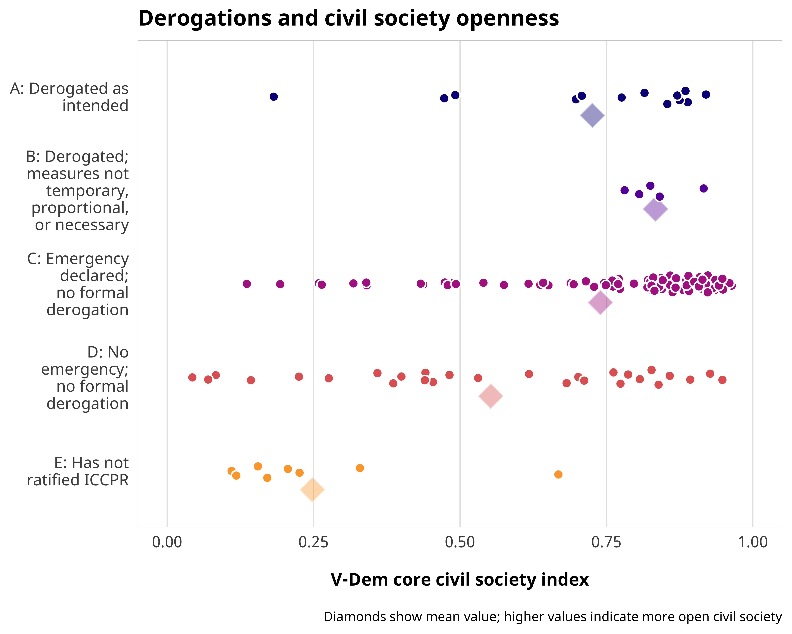

## Important links

- [Paper (preprint)](chaudhry-heiss-derogations.pdf)
- [Statistical analysis notebook](https://stats.andrewheiss.com/covid-derogations/)
- [GitHub repository](https://github.com/andrewheiss/covid-derogations)


## Abstract

In an effort to combat the COVID-19 pandemic, most governments have imposed restrictions on movement, association, and other civic freedoms in the interest of public health. In many cases, such as New Zealand, these emergency measures have been temporary and respect for human rights has returned to normal. In many other instances, however, governments have used these restrictions to suppress opposition and more permanently restrict civic space. Systematically measuring the consequences of COVID restrictions, however, is a difficult task. We will examine two possible quantitative measures of the relationship between of COVID restrictions and civil society space. First, we will use the Variety of Democracy project’s newly released Pandemic Violations of Democratic Standards Index to explore if and how civil society restrictions predict pandemic backsliding. Second, while many countries sign international human rights treaties that ostensibly bind states to respect rights, several treaties allow for emergency derogations from these obligations. We will tabulate formal human rights treaty derogations due to the pandemic and explore whether these emergency measures led to lasting declines in associational and human rights. We hope that our exploration of these two measures will provide rich data-based descriptions of the relationship between COVID restrictions and civic space that will allow for more causal work in the future.


## Important figure

Figure 5: Derogation decisions across pandemic violations and pandemic backsliding




## BibTeX citation

```bibtex
@unpublished{ChaudhryHeiss:2021,
    Author = {Suparna Chaudhry and Andrew Heiss},
    Note = {Working paper},
    Title = {Derogations and Democratic Backsliding: Exploring the Pandemic's Effects on Civic Spaces},
    Year = {2021}}
```
