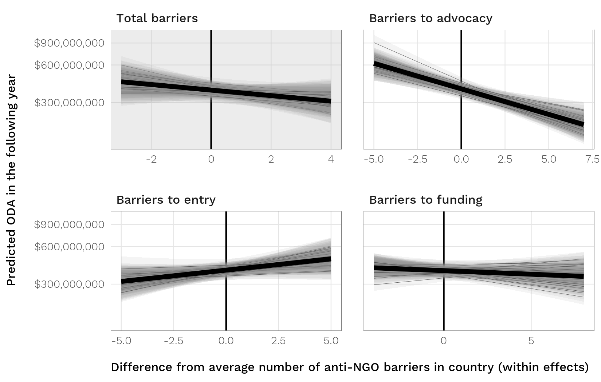

## Important links

- [Paper (preprint)](chaudhry-heiss-ngos-aid.pdf)
- [Supplement (preprint)](chaudhry-heiss-ngos-aid-supplement.pdf)
- [Statistical analysis notebook](https://stats.andrewheiss.com/donors-ngo-restrictions/)
- [GitHub repository](https://github.com/andrewheiss/donors-ngo-restrictions)


## Abstract

Foreign donors routinely use nongovernmental organizations (NGOs) to deliver foreign aid. However, states are increasingly relying on repressive legislation to crack down on NGOs within their borders. How have foreign aid donors responded to this legal crackdown on NGOs? Using original data from all countries that received aid from 1981–2012, we assess the impact of anti-NGO laws on total flows of official foreign aid, the nature of projects funded, and the channels used for distributing this aid. Overall, we find that donors scale back their operations in repressive countries. However, rather than completely withdraw, we find that donors redirect funds within restrictive countries by decreasing funds for politically sensitive issues, and channeling more aid through domestic rather than foreign NGOs. While our findings challenge existing notions of foreign aid running on "autopilot," they also have worrying implications for Western donors and domestic NGOs working on contentious issues.


## Figure

Figure 5: Predicted ODA (foreign aid) across a range of differences from average number of anti-NGO laws in an average country; dark line shows average of 500 draws from posterior distribution.



## BibTeX citation

```bibtex
@unpublished{ChaudhryHeiss:2018,
    Author = {Suparna Chaudhry and Andrew Heiss},
    Note = {Working paper},
    Title = {Are Donors Really Responding? Analyzing the Impact of Global Restrictions on {NGO}s},
    Year = {2018}}
```
