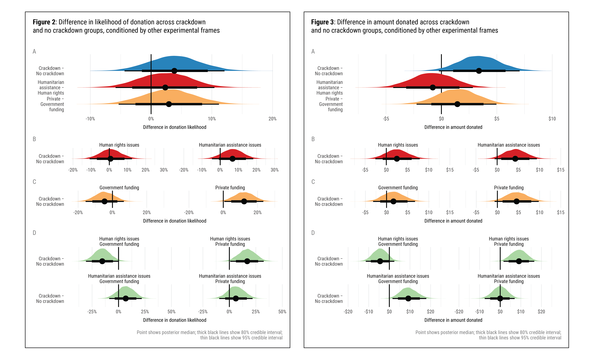

&nbsp;

 &emsp;  &emsp; 

## Important links

- [Paper (preprint)](chaudhry-heiss-ngos-philanthropy.pdf)
- [Supplement (preprint)](chaudhry-heiss-ngos-philanthropy-supplement.pdf)
- [Statistical analysis notebook](https://stats.andrewheiss.com/ngo-crackdowns-philanthropy/)
- [GitHub repository](https://github.com/andrewheiss/ngo-crackdowns-philanthropy)
- [Experiment preregistration](https://osf.io/dx973/register/565fb3678c5e4a66b5582f67)

## Media coverage

- ["Donors grow more generous when they support nonprofits facing hostile environments abroad,"](https://theconversation.com/donors-grow-more-generous-when-they-support-nonprofits-facing-hostile-environments-abroad-150436) *The Conversation*, December 7, 2020

## Abstract

State restrictions on non-governmental organizations (NGOs) have become increasingly pervasive across the globe. While this crackdown has been shown to have a negative impact on public funding flows, we know little about how it impacts private philanthropy. How does information about crackdown abroad, as well as organizational attributes of nonprofits affect individual donors’ willingness to donate internationally? Using a survey experiment, we find that learning about repressive NGO environments increases generosity in that already-likely donors are willing to donate substantially more to legally besieged nonprofits. This generosity persists when mediated by two organizational-level heuristics: NGO issue areas and main funding sources. We discuss the implications of our results on how nonprofits can use different framing appeals to increase fundraising at a time when traditional public donor funding to such organizations is decreasing.


## Important figures

Figures 2 & 3: Difference in likelihood of donation across crackdown and no crackdown groups, conditioned by other experimental frames + difference in amount donated across crackdown and no crackdown groups, conditioned by other experimental frames




## BibTeX citation

```bibtex
@article{ChaudhryHeiss:2021,
    Author = {Suparna Chaudhry and Andrew Heiss},
    Doi = {10.1177/0899764020971045},
    Journal = {Nonprofit and Voluntary Sector Quarterly},
    Month = {6},
    Number = {3},
    Pages = {481--505},
    Title = {Dynamics of International Giving: How Heuristics Shape Individual Donor Preferences},
    Volume = {50},
    Year = {2021}}
```
