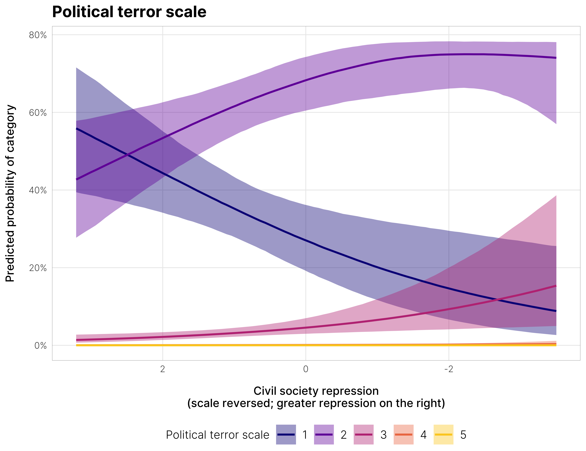
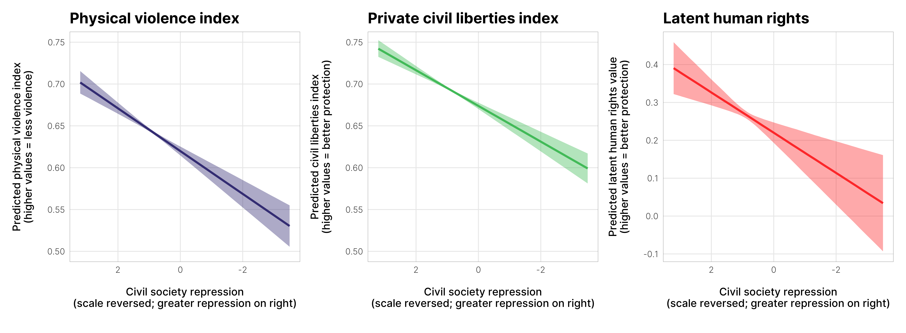

## Important links

- [Paper (preprint)](chaudhry-heiss-ngos-repression.pdf)
- [Statistical analysis notebook](https://stats.andrewheiss.com/canary-ngos/)
- [GitHub repository](https://github.com/andrewheiss/canary-ngos)


## Abstract

Many countries across the globe use legal restrictions to crack down and limit civil society. These attempts to repress civil society organizations—many of which are sanctioned by law—represent a bureaucratic form of repression that could indicate more severe human rights abuses and democratic backsliding. This is especially the case for electoral democracies, which unlike autocracies do not aggressively and openly attack civic space. In this paper, we explore if crackdowns on NGOs predict broader human rights repression. We argue that this is the case because anti-NGO laws are among the most subtle means of repression and attract the least least domestic and international condemnation, as many audiences mistake this repression as regulation and are not personally affected by it. These laws also make it easier for states to prevent and deter future large-scale popular mobilization. Using original data on civil society restrictions over the last three decades, we test whether NGO crackdown is a predictor of political terror, physical violence, and violations of private civil liberties. This project has important implications: if crackdown on NGOs is indeed an early warning, it can potentially prevent further deterioration in space for civil society.


## Important figures

Figure 6: Marginal effects of changing levels of civil society repression on the probability of specific levels of political terror



Figure 7: Marginal effects of changing levels of civil society repression on V-Dem rights indexes and latent human rights




## BibTeX citation

```bibtex
@unpublished{ChaudhryHeiss:2021,
    Author = {Suparna Chaudhry and Andrew Heiss},
    Note = {Working paper},
    Title = {Canary in the Coal Mine: Anti-NGO Legislation as a Predictor of Civil Society Repression},
    Year = {2021}}
```
