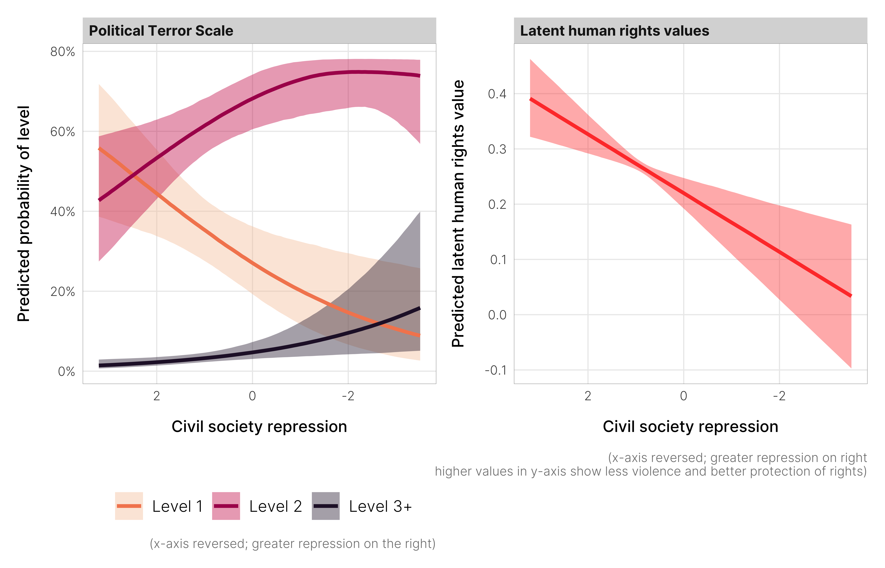

## Important links

- [Paper (preprint)](chaudhry-heiss-ngos-repression.pdf)
- [Statistical analysis notebook](https://stats.andrewheiss.com/cautioning-canary/)
- [GitHub repository](https://github.com/andrewheiss/cautioning-canary)


## Abstract

An increasing number of countries have recently cracked down on non-governmental organizations (NGOs). Much of this crackdown is sanctioned by law and represents a bureaucratic form of repression that could indicate more severe human rights abuses in the future. This is especially the case for democracies, which unlike autocracies, may not aggressively attack civic space. We explore if crackdowns on NGOs predict broader human rights repression. Anti-NGO laws are among the most subtle means of repression and attract lesser domestic and international condemnation compared to the use of violence. Using original data on NGO repression, we test whether NGO crackdown is a predictor of political terror, and violations of physical integrity rights and civil liberties. We find that while de jure anti-NGO laws provide little information in predicting future repression, their patterns of implementation—or de facto civil society repression—predicts worsening respect for physical integrity rights and civil liberties.


## Important figures

Figure 6: Marginal effects of changing levels of civil society repression on the probability of specific levels of political terror and predicted latent human rights values



Figure 7: The disconnect between Egypt’s de jure 2002 law and the widespread de facto repression of civil society a decade later


## BibTeX citation

```bibtex
@article{ChaudhryHeiss:2022,
    Author = {Suparna Chaudhry and Andrew Heiss},
    Doi = {10.1080/14754835.2022.2030205},
    Journal = {Journal of Human Rights},
    Number = {2},
    Pages = {123--140},
    Title = {NGO Repression as a Predictor of Worsening Human Rights Abuses},
    Volume = {21},
    Year = {2022}}
```
