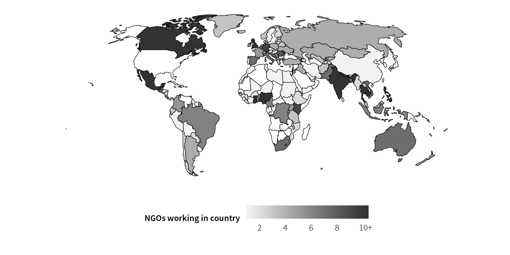
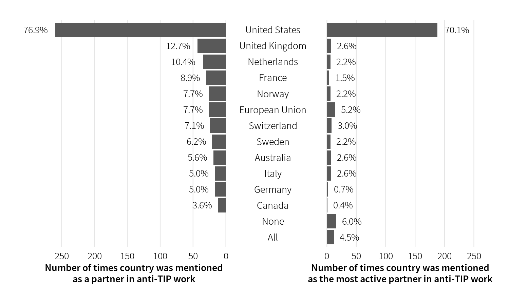
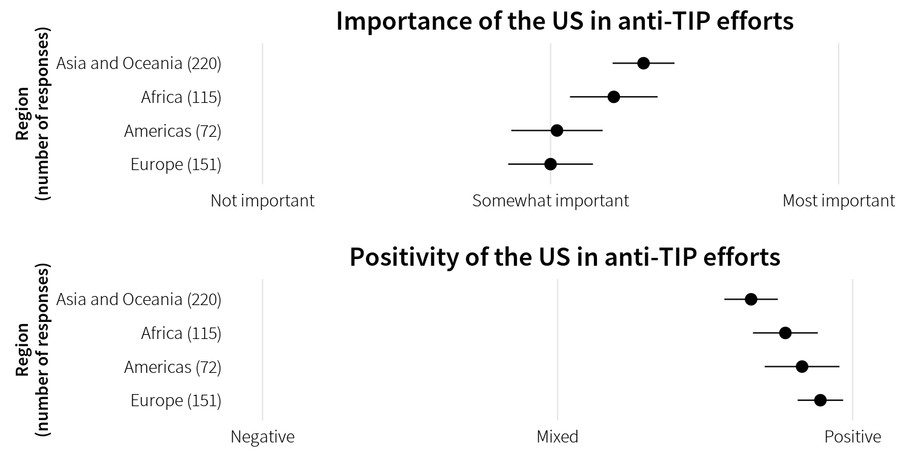

## Abstract

Amid the academic and policy critiques of the United States 15-year push to eliminate human trafficking, the perspective of the nongovernmental organizations (NGOs) working with anti-trafficking advocacy and services has been largely ignored. This article presents the results of a global survey of nearly 500 anti-trafficking NGOs in working in 133 countries, and is the first NGO-focused survey of its kind. Based on the results of the survey, we provide an overview of the anti-trafficking NGO sector as a whole, detail the relationship between anti-trafficking NGOs and the US, and account for some of the variation in NGO opinions of US efforts. Notably, we find that NGOs are remarkably satisfied with US-led efforts—despite their acknowledged flaws—and that NGOs believe that American anti-TIP policies are important and, on balance, helpful. These results also provide a warning for the future of the United States' anti-trafficking advocacy, suggesting that the US avoid politicizing its annual Trafficking in Persons Report.


## Important figures

Figure 1: Countries where NGOs work, excluding NGOs working only in the US



Figure 4: Embassies or foreign governments NGOs reported as active partners in the fight against human trafficking



Figure 7: Average importance and positivity of US anti-TIP efforts across regions




## BibTeX citation

```bibtex
@article{HeissKelley:2017,
  Author = {Andrew Heiss and Judith G. Kelley},
  Doi = {10.1080/23322705.2016.1199241},
  Journal = {Journal of Human Trafficking},
  Number = {3},
  Pages = {231--254},
  Title = {From the Trenches: A Global Survey of Anti-{TIP} {NGOs} and their Views of {US} Efforts},
  Volume = {3},
  Year = {2017}}
```
