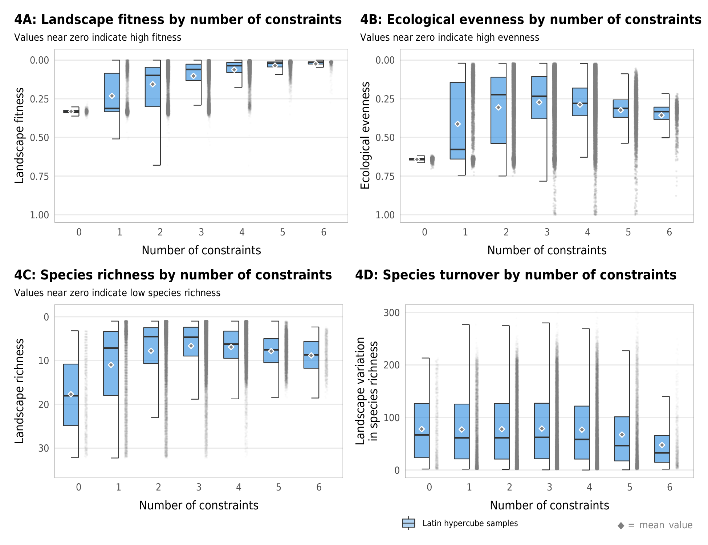

## Important links

- [Paper (preprint)](peck-heiss-constraint-closure.pdf)
- [Statistical analysis notebook](https://stats.andrewheiss.com/constraint-closure/)
- [GitHub repository](https://github.com/andrewheiss/constraint-closure/)

## Abstract

Ecological theorists have generated several yet unresolved disputes that try to untangle the difficulty in understanding the nature of complex ecological communities. In this paper, we combine two recent theoretical approaches that used together suggest a promising way to consider how evolutionary and ecological processes may be used to frame a general theory of community ecology and its functional stability. First, we consider the theoretical proposal by Mark Vellend (2016) to focus on a small set of higher-level evolutionary and ecological processes that act on species within an ecological community. These processes provide a basis for ecological theory similar to the way in which theoretical population genetics has focused on a small set of mathematical descriptions to undergird its theory. Second, we explore ideas that might be applied to ecosystem functioning developed by Alvaro Moreno and Matteo Mossio's (2015) work on how biologically autonomous systems emerge from closure of relevant constraints. To explore the possibility that combining these two ideas may provide a more general theoretical understanding of ecological communities, we have developed a stochastic, agent-based model, with agents representing species, that explores the potential of using evolutionary and ecological processes as a constraint on the flow of species through an ecosystem. We explore how these ideas help illuminate aspects of stability found in many ecological communities. These agent-based modeling results provide in-principle arguments that suggest that constraint closure, using evolutionary and ecological processes, explains general features of ecological communities. In particular, we find that our model suggests a perspective useful in explaining repeated patterns of stability in ecological evenness, species turnover, species richness, and in measures of fitness.


## Important figure

Figure 4: Boxplots show ecological measures across parameter space for different numbers of constraints generated by 2000 iterations of the simulation model across all 64 possible permutations of the proposed constraints being present or absent, and with uniform random values of parameters pulled from their possible values in the model iterations. The whiskers in the box plot show the range of variation. The actual data used to construct the boxplots are shown as fine gray dots to the right of each box plot. (a) Effect of the number of constraints on landscape fitness. (b) Effect of the number of constraints on ecological evenness. (c) Effect of the number of constraints on the average cell species richness (number of species defined as functional groups) present in the cell-niche. (d) Effect of the number of constraints on the difference between turnover in mutualistic linked and unlinked species. The turnover rate is the number of new species created at each time step in each cell.




## BibTeX citation

```bibtex
@article{PeckHeiss:2021,
    Author = {Steven L. Peck and Andrew Heiss},
    Doi = {10.1111/oik.07621},
    Journal = {Oikos},
    Title = {Can Constraint Closure Provide a Generalized Understanding of Community Dynamics in Ecosystems?},
    Year = {Forthcoming}}
```
