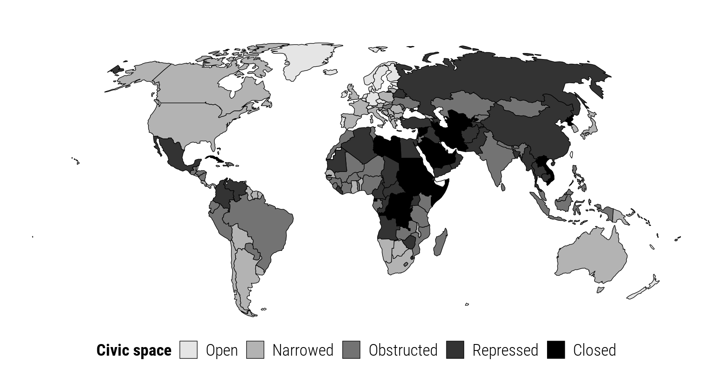

## Important figure

Figure 1: 2017 CIVICUS Monitor civic space ratings




## BibTeX citation

```bibtex
@incollection{ChaudhryHeiss:2021,
    Address = {Tuscaloosa, AL},
    Author = {Suparna Chaudhry and Andrew Heiss},
    Booktitle = {Beyond the Boomerang: New Patterns in Transcalar Advocacy},
    Editor = {Christopher L. Pallas and Elizabeth Bloodgood},
    Publisher = {University of Alabama Press},
    Title = {Closing Space and the Restructuring of Global Activism: Causes and Consequences of the Global Crackdown on {NGOs},
    Chapter = {2},
    Year = {2021}}
```
