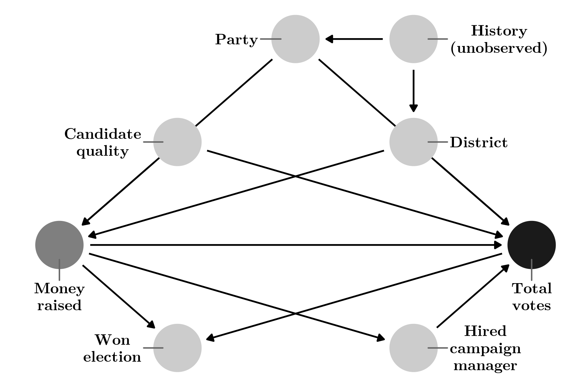
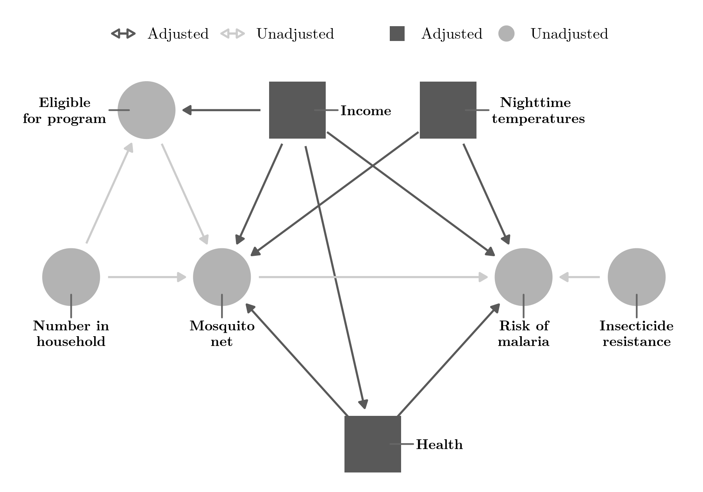

## Abstract

One of the most repeated phrases in any introductory statistics class is the warning that “correlation is not causation.” This chapter presents new non-statistical language for creating, measuring, and evaluating causal stories and relationships using observational (i.e. non-experimental) data. It introduces the concept of causal directed acyclic graphs (DAGs) that allow us to formally encode our understanding of causal stories. With well-crafted DAGs, one can use a set of rules called do-calculus to make specific adjustments to statistical models and isolate or identify causal relationships between variables of interest. Edges (or arrows) transmit associations between nodes. Following the fundamental problem of causal inference, answering causal questions without an experiment appears impossible. The chapter explores different methods of making adjustments using synthetic data. Instead of throwing away potentially useful data, one can use other methods to create matches that are less discrete and more informative.


## Important figures

Figure 6: More complicated DAG showing the relationship between campaign spending and votes won in an election



Figure 17: Adjustment set to identify the relationship between mosquito net use and malaria risk




## BibTeX citation

```bibtex
@incollection{Heiss:2021,
    address = {Boca Raton, Florida},
    author = {Andrew Heiss},
    booktitle = {R for Political Data Science: A Practical Guide},
    chapter = {10},
    editor = {Francisco Urdinez and Andr{\'e}s Cruz},
    pages = {235--274},
    publisher = {{Chapman and Hall} / CRC},
    title = {Causal Inference},
    year = {2021}}
```
